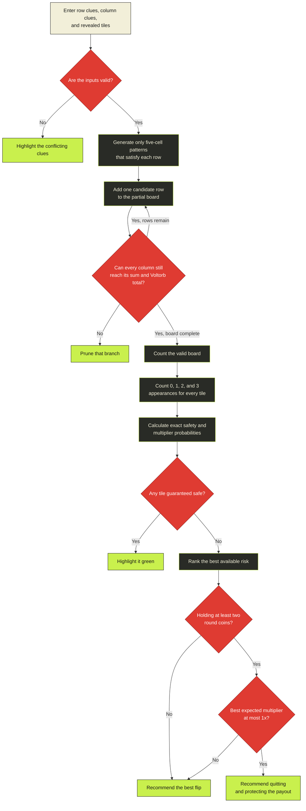

<div align="center">

# 🔴 VOLTORB<span>//</span>LAB ⚡

### FLIP SMARTER. KEEP YOUR COINS.

**An exact, instant Voltorb Flip solver for Pokémon HeartGold & SoulSilver.**


```text
        ╭─────────╮
      ╭─┤  ╲   ╱  ├─╮        ┌─────┬─────┬─────┬─────┬─────┐
     │  ╰────┬────╯  │       │100% │ 82% │100% │ 64% │ 91% │
     │     ╲ │ ╱     │       ├─────┼─────┼─────┼─────┼─────┤
      ╰──────┴──────╯        │  ?  │  3  │  ?  │  ?  │  2  │
         V O L T O R B        └─────┴─────┴─────┴─────┴─────┘
```

</div>

---

## ◆ What is this?

Voltorb Flip is part logic puzzle, part calculated risk, and part extremely effective frustration machine. Voltorb Lab turns the ten edge clues and your revealed tiles into exact constraint probabilities—then points you toward guaranteed-safe flips or the best available gamble.

No screenshots. No tedious board recreation. Just enter the clues exactly as they appear in-game and start flipping.

## ⚡ Features

- **Exact board enumeration** — considers every grid consistent with your clues
- **Guaranteed-safe highlighting** — acid green means there is no possible Voltorb
- **Best-move ranking** — balances survival odds with multiplier potential
- **Instant recalculation** — every reveal immediately narrows the board
- **Fast input** — touch controls plus keyboard shortcuts
- **Persistent record** — wins, losses, and win rate survive between sessions
- **Coin Case goals** — compare your balance with any HeartGold Game Corner prize and add cleared-board payouts automatically
- **Dramatic failure** — because hitting a Voltorb deserves a proper `KABOOM`
- **Responsive design** — built for a phone beside your DS, as nature intended

## 🎮 How to use it

1. Copy the point total and Voltorb count for all five rows and columns.
2. Flip any tile marked **100% SAFE**.
3. Choose its revealed value below the board, then tap that tile.
4. Repeat until every `2` and `3` is uncovered.
5. If the game declares victory before the solver can infer it, press **Board cleared +1 W**.

| Key | Action |
|:---:|:-------|
| `1` | Record a 1 |
| `2` | Record a 2× multiplier |
| `3` | Record a 3× multiplier |
| `V` or `0` | Record a Voltorb and a loss |
| `U` or `Backspace` | Clear a recorded tile |

> [!TIP]
> A line where **points + Voltorbs = 5** contains only `1`s and Voltorbs. It has no multipliers, so you can usually ignore it.

## 🧠 How the solver works

Brute-forcing every possible board would mean checking `4²⁵` grids. That is approximately **1.1 quadrillion** bad ideas.

Voltorb Lab instead:

1. Generates only the five-tile patterns that satisfy each row.
2. Rejects patterns that conflict with revealed tiles.
3. Combines rows using dynamic programming.
4. Prunes partial boards that can no longer satisfy a column.
5. Counts the remaining value frequencies for every tile.



The displayed probability is exact across all clue-compatible layouts treated equally. Level-dependent board generation can affect the game’s true prior odds, but it cannot invalidate a move shown as guaranteed safe.

## 🕹️ Run locally

Requires **Node.js 22.13+**.

```bash
git clone https://github.com/theedward/voltorb-flip.git
cd voltorb-flip
npm install
npm run dev
```

Open **[localhost:3000](http://localhost:3000)**.

## 🧪 Validate

```bash
npm run lint
npm test
```

The tests cover server rendering, known-board probability counts, safe-tile detection, and conflicting reveals.

## 🧰 Stack

`React 19` · `TypeScript` · `vinext` · `Cloudflare D1` · `Drizzle ORM` · `Tailwind CSS`

---

<div align="center">

### 🔴 DON'T FLIP ANGRY. FLIP INFORMED. 🔴

<sub>Unofficial fan-made utility. Pokémon, Voltorb, HeartGold, and SoulSilver are trademarks of their respective owners.</sub>

</div>
